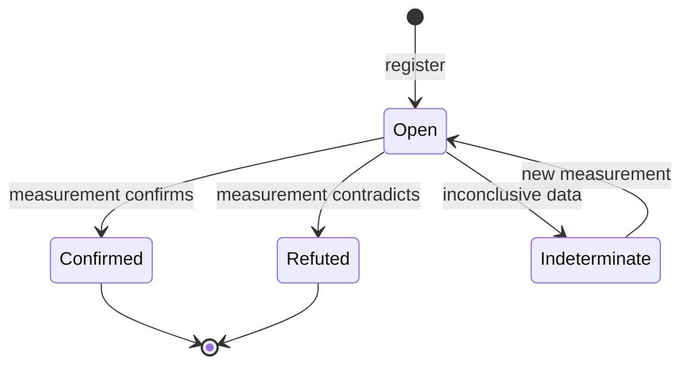

# Conjecture State Machine

```mermaid
stateDiagram-v2
    [*] --> Open: register
    Open --> Confirmed: measurement confirms
    Open --> Refuted: measurement contradicts
    Open --> Indeterminate: inconclusive data
    Confirmed --> [*]
    Refuted --> [*]
    Indeterminate --> Open: new measurement
```
