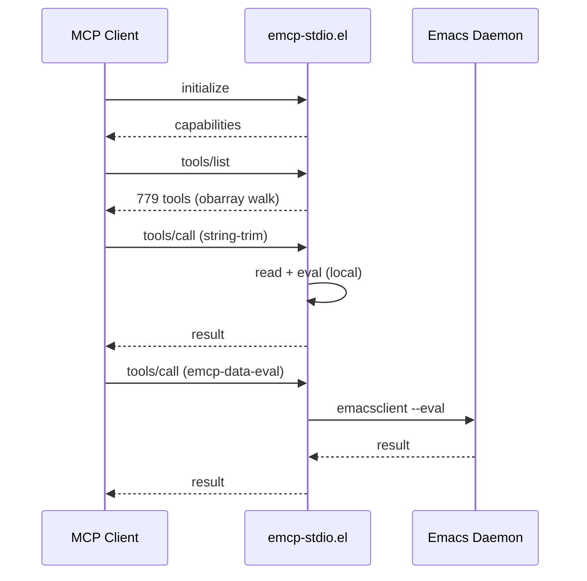

# MCP Protocol Sequence

```mermaid
sequenceDiagram
    participant Client as MCP Client
    participant Server as emcp-stdio.el
    participant Daemon as Emacs Daemon
    Client->>Server: initialize
    Server-->>Client: capabilities
    Client->>Server: tools/list
    Server-->>Client: 779 tools (obarray walk)
    Client->>Server: tools/call (string-trim)
    Server->>Server: read + eval (local)
    Server-->>Client: result
    Client->>Server: tools/call (emcp-data-eval)
    Server->>Daemon: emacsclient --eval
    Daemon-->>Server: result
    Server-->>Client: result
```
