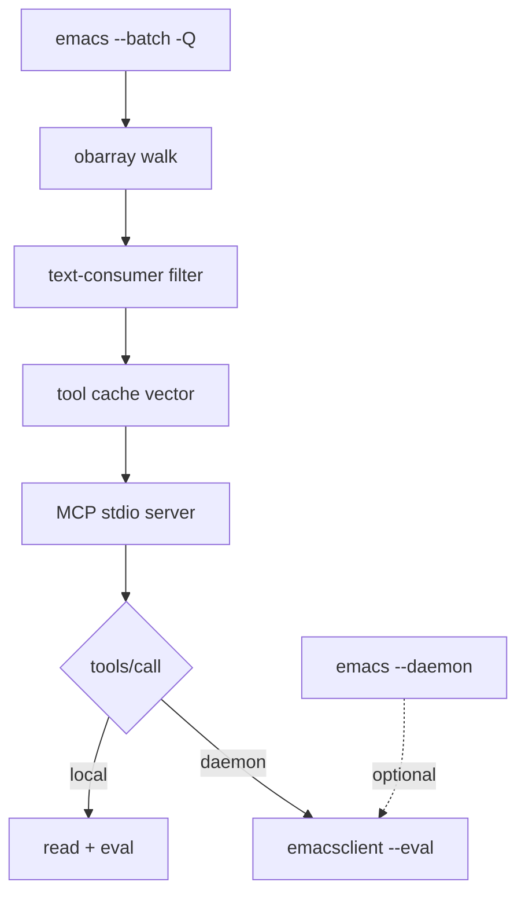

# Pipeline DAG

```mermaid
graph TD
    A[emacs --batch -Q] --> B[obarray walk]
    B --> C[text-consumer filter]
    C --> D[tool cache vector]
    D --> E[MCP stdio server]
    E --> F{tools/call}
    F -->|local| G[read + eval]
    F -->|daemon| H[emacsclient --eval]

    I[emacs --daemon] -.->|optional| H
```
